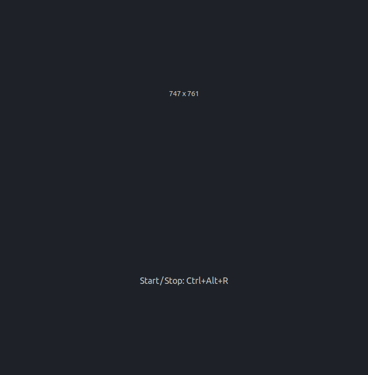
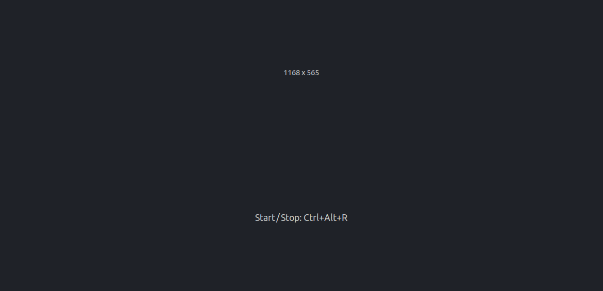
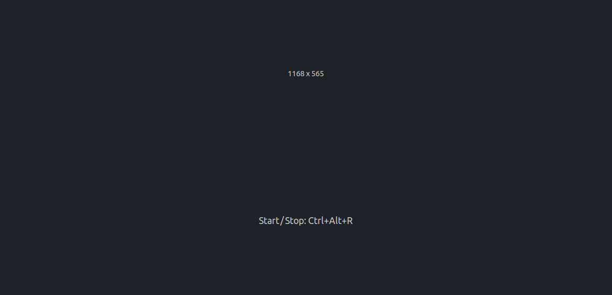

# Animated Algorithms

The objective of this repository is to **animate foundational algorithms in computer science**.
By looking into the code alongside the visual demo, learners can develop deeper
and more intuitive understanding of these algorithms.

Contributions from the community to expand and improve this resource, whether
by adding new algorithm visualizations, improving existing code, suggesting
enhancements, or making other educators or learners aware of this repository, are
warmly welcomed.

# Table of Content

- [Getting Started](#getting-started)
- [Algorithms](#algorithms)
  - [Sort Algorithms](#sorting-algorithms)
    - [Insertion Sort](#insertion-sort)
    - [Bubble Sort](#bubble-sort)
    - [Quick Sort](#quick-sort)
  - [Backtracking Algorithm](#backtracking-algorithm)
  - [Dynamic Programming](#dynamic-programming)
  - [Motion Planning](#motion-planning)
    - [RRT Algorithm](#rrt-algorithm)
- [Data Structures](#data-structures)
  - [Binary Search Tree](#binary-search-tree)
  - [AVL Tree](#avl-tree)
  - [Tree Traversal](#tree-traversal)
    - [Inorder](#inorder)
    - [Preorder](#preoder)
    - [Postorder](#postorder)
    - [Level-Order](#level-order)
- [Contribution](#contribution)

# Getting Started

To get started, you need to follow the steps below

- Clone the repository

```bash
git clone <repository-url>
```

- Navigate to the root directory of the project (the directory which contains `README.md`)
  and create a virtual environment (`.env`)

```python
python -m venv .env
```

- Activate the environment

```bash
source .env/bin/activate
```

- Install the requirements

```bash
pip install -r requirements.txt
```

Now, you can run any example in the repo. For example, to run the example for
the backtracking algorithm, you execute

```bash
python3 algorithms/backtracking.py
```

# Algorithms

## Sorting Algorithms

### Insertion Sort

Insertion Sort is a simple sorting algorithm that works the way people often
sort playing cards in their hands. It builds the sorted list one element at a
time by repeatedly picking an element from the unsorted part and placing it in
the correct position within the sorted part. It works as follows:

- Compare the current element (highlighted in yellow) with the elements in the
  sorted subarray (highlighted in green)
- Shift larger elements in the sorted subarray to the right to make space for
  the current element (highlighted in red).
- Insert the current element into its correct position.
- Repeat for all elements until the entire array is sorted.

You can find the code for the animated insertion sort [here](algorithms/insertion_sort.py)


#### Best Case

The best case for insertion sort occurs when the array is already sorted.


#### Worst Case

The worst case for insertion sort occurs when the array is reverse sorted.


### Bubble Sort

Bubble Sort is a comparison-based sorting algorithm. It works by repeatedly
stepping through the array to be sorted, comparing each pair of adjacent elements,
and swapping them if they are in the wrong order. This process is repeated
until the array is sorted.

You can find the code for the animated the bubble sort algorithm [here](algorithms/bubble_sort.py).


#### Best Case

The best case for bubble sort occurs when the array is already sorted.


#### Wort Case

The worst case for bubble sort occurs when the array is reverse sorted.


### Quick Sort

Quicksort is widely used because of its speed and simplicity. The algorithm is
based on the divide-and-conquer strategy, which means it breaks the problem
into smaller parts, solves those parts, and combines the results. Here is how
quicksort works step by step:

- Pick a Pivot: Choose one element from the array. This is called the pivot.
  Common choices for the pivot include the first element, the last element, or
  a random element. We pick the last element as the pivot following the CLRS [Introduction to Algorithms](https://en.wikipedia.org/wiki/Introduction_to_Algorithms).
- Partition the array: Divide the array into two smaller subarrays:
  - elements smaller than the pivot which will be moved to the _left_ of the pivot.
  - elements larger than the pivot which will be moved to the _right_ of the pivot.
  - The pivot itself will be in the correct position in the sorted array after this step.
- Repeat the process (recursively) on the two smaller subarrays
  (the _left_ and _right_ subarrays) until the entire array is sorted.

You can find the code for the animated quicksort [here](algorithms/quicksort.py).

**About the Animation**

In the animation of quicksort:

- The current subarray is highlighted in red and displayed above the rest of
  the array, except when the whole array is being processed.
- The pivot is always the last element of the subarray and highlighted in blue.
- The partition index is highlighted in orange. This indicates the position
  where the pivot will be placed, dividing the array into a left subarray of
  smaller elements and a right subarray of larger elements.
- The current element _being compared to the pivot_ is highlighted in yellow,
  with a connecting line drawn between the two to emphasize the comparison.
  - If the current element is smaller than the pivot, it is already in the
    correct position (i.e it is part of the left subarray) and the partition
    index is advanced one step to the right.
  - If the current element is larger than the pivot:
    - The partition index remains unchanged.
    - Later, if a smaller element is encountered (it is in the wrong part as it
      is currently in the right subarray), it will be swapped with the element
      at the current partition index (to move it to the left subarray) and the
      partition index is moved one step to the right.
- Finally, the pivot is inserted into the partition index and this move is
  highlighted in blue.


Quicksort is more complex compared to insertion sort and bubble sort. If it is
not clear, you can play the animation ([here](algorithms/quicksort.py)) with
different arrays of different lengths until you develop an intuition of how the
algorithm works. Then, revisit the explanation above and it will hopefully
makes more sense.

### Best Case

The best case of quicksort occurs when the pivot chosen at each step divides
the array into two nearly equal-sized subarrays.


### Worst Case

Quicksort performs its worst when the array is already sorted (or reverse sorted)
because both cases will lead to highly unbalanced partitions. In these cases,
each step reduces the problem size by just one element. For an array of size
$n$ this results in recursive calls $n-1$ resulting in overall $O(n^2)$ running
time.


## Backtracking Algorithm

Backtracking is a general problem solving technique that builds a solution
incrementally and abandons "backtracks" a candidate move if it will lead to
invalid solution. Please read more on backtracking
[here](https://en.wikipedia.org/wiki/Backtracking).
In the case of the eight aueens puzzle, assume we placed $k-1$ queens in the
first $k-1$ rows. The algorithm places a queen in the $k^{th}$ row as long as
it does not threaten a previously placed queen in any of the previous rows.
If that is not possible, the algorithm removes the queen in the $(k-1)^{th}$ row
and try to find a new position for it. If it succeeds, it proceeds forward.
Otherwise, it goes backward again to the $(k-2)^{th}$ row and so on.

You can find the code for the animated backtracking algorithm [here](algorithms/backtracking.py).

### Eight Queens Puzzle

The 8 queens puzzle is concerned with placing 8 queens in an $8 \times 8$ chess
board such that no queen threatens any other queen. Please read more on the
eight queens puzzle [here](https://en.wikipedia.org/wiki/Eight_queens_puzzle).
In this repo we present a solution to the general N queens puzzle in $N\times N$
chess board.

### Animation

In the animation, the forward move is hightlighted in yellow, the backward move
is highlighted in red, and a solid red line is drawn to connect the two queens
that threaten each other.

#### 4 Queens

<p align="center">

</p>

#### 8 Queens

<p align="center">

</p>

## Dynamic Programming

To be completed ...

## Motion Planning

### RRT Algorithm

The Rapidly-exploring Random Tree (RRT) algorithm is a popular motion planning
(path planning) algorithm used in robotics and artificial intelligence. It is
designed to find a path from a starting point to a goal point in a space with
obstacles. Read more about RRT [here](https://en.wikipedia.org/wiki/Rapidly_exploring_random_tree). The versionimplemented in this repository is described below.

You can find the code for the animated RRT [here](algorithms/randomly_exploring_random_tree.py).

Initialization:

- Start with an empty tree.
- Add the starting point as the root of the tree.

Random Sampling:

- Randomly sample a point in the space. This point is called the _random point_.

Nearest Neighbor Search:

- Find the point in the existing tree that is closest to the random point. This
  point is called the _nearest point_.

Extension:

- Extend the tree from the nearest point towards the random point by a small
  step size to create a _new point_.

Collision Checking:

- Check if the path from the nearest point to the new point collides with any
  obstacles.
  - If there is a collision, discard the new point and repeat the process from
    step 2.
  - Otherwise, accept the new point and add it to the tree

Goal Checking:

- Check if the new point is close enough to the target.
  - If it is, backtrack the path from the new point to the root to establish the obstacle-free path.
  - Otherwise, repeat the process from step 2.

Termination:

- Repeat steps 2 to 5 until a path to the goal is found or a maximum number of
  iterations is reached.

### Animation

In the animation, blue rectangles represent obstacles, a red circle indicates
the target, and the tree grows from the screen's center.

<!-- #### Small Tree

<p align="center">

</p>

#### Large Tree -->

<p align="center">

</p>

# Data Structures

## Binary Search Tree

A binary search tree (BST) is a fundamental data structure. It is a tree where
every node has a _value_, a _parent_ (can be NULL), a _left child_, and
a _right child_. BST satifies the following properties:

- The value of every node in the left subtree is less than the value of the
  parent node.

- The value of every node in the right subtree is greater than or equal the
  value of the parent node.

When a node has no parent (parent = NULL) it is called the _root_ of the tree
and when a node has no children it is called a _leave_.

You can find the code for the animated BST ([here](data_structures/binary_search_tree.py) for non-OOP approach - legacy) and ([here](data_structures/tree.py) and [here](data_structures/animation.py) for an OOP approach - preferred approach).

An example of _efficient balanced BST_ is presented below which has a depth
$O(log(n))$ where $n$ is the number of nodes in the tree.


An example of _inefficient unbalanced BST_ (with a depth of $O(n)$) is shown below.


## AVL Tree

To be completed ...

## Tree Traversal

Tree traversal is the process of visiting all the nodes in the tree in a
specific order. In the animation below, the following node states are
highlighted in different colors:

- UNVISITED: the node has not been encountered yet. This is highlighted in gray.
- VISITED: the node has been seen during the tree traversal but its attributes
  (value, etc) has not been accessed yet. This is highlighted in red.
- ACCESSED: the node has been VISITED and its attributes are accessed. This is
  highlighted in green.

You can find the code for tree traveral algorithms [tree traveral](data_structures/tree_traversal.py)

### Inorder

In inorder traversal, the nodes of a binary tree are visited in the following
order:

- Visit the left subtree.
- Visit the current node (the root of the subtree being considered). The current
  node is _accessed_ at this step.
- Visit the right subtree.



### Preoder

In preorder traversal, the nodes of a binary tree are visited in the following order:

- Visit the current node (the root of the subtree being considered). The current
  node is _accessed_ at this step.
- Visit the left subtree.
- Visit the right subtree.


### Postorder

In postorder traversal, the nodes of a binary tree are visited in the following order:

- Visit the left subtree.
- Visit the right subtree.
- Visit the current node (the root of the subtree being considered). The current
  node is _accessed_ at this step.



### Level-Order

In level-order traversal, the nodes of a binary tree are visited in the following order:

- Start at the root node (level 0). Access the root.
- Process all nodes at the current level from left to right. Access the current
  node.
- Move to the next level.
- Repeat until all nodes at all levels are visited.


# Contribution

If you would like to contribute, whether by adding new features, improving the
codebase, bug fixing, or providing feedback, your input is greatly appreciated.
**Please feel free to open issues, submit pull requests, or suggest improvements.**
If you would like to **become a collaborator**, please drop me an email at <a href="mailto:ahmedhassan@aims.ac.za">ahmedhassan@aims.ac.za</a>.

The animated algorithms are created in Python. You can use any Python library
to create your animated algorithms. Currently, both [Pygame](https://pypi.org/project/pygame/)
and [Pyglet](https://pypi.org/project/pyglet/) are used.
If you use something else, please remember to add it to the `requirements.txt`
if it is not already there.
